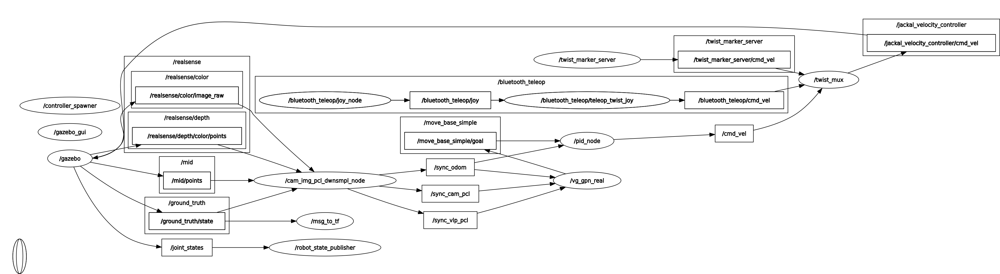

# vg-nav
[Visual-Geometry GP-based Navigable Space for Autonomous Navigation]

## Main contribution 
- our main contribution is the `vg_nav` package, other packages are adapoted from other repos to run the simulator.


### Dependencies
- tensorflow (TF)
- tensorflow_probability (TFP)
- gpflow (gpf)

### Compatibility: 
- The code was tested using the following versions of dependencies: nvidia-driver 470, cuda 11.4, cudnn 8.2.4, TF 2.11.0, TFP 0.19.0, gpf 2.5.1.


### Running the code
1. Run Simulation Environment and spawn jackal
```bash
roslaunch jackal_gazebo postoffice_mud.launch
```
2. Launch `vg_nav.launch` to run `nav_sync_node.py`, `rgb_seg`, and `vg_nav_node` nodes
```bash
roslaunch vg_gpn vg_gpn_real.launch 
```
- Note: for simulation we are doing the segmentation based on the RGB values of the raw image. To tune the minimum and maximum values for each channel, we use the `rq_reconfigure` package. the values working for the postoffice_mud environment is stored in the `cfg` file. After you tune the RGB values and check the generated `nav_image` in `rviz`, run the `pid_tracking_node`.
3. Run the PID controller to move the robot to the select visual-geometry local navigation point `VG-LNP`
```bash
roslaunch waypts_nav_pid pid_tracking.launch 
```

### Notes
- export JACKAL_URDF_EXTRAS= "path to `realsense.urdf.xacro`" [export JACKAL_URDF_EXTRAS=realsense.urdf.xacro], this to ensure that the `realsense` plugin works in gazebo
- For real hardware experiments we used `mask2former` for segmenting the camera image and based on which classes we define as navigable, we generate the `nav_img` using the `mask2former_nav_img.py` script. to use this script, you need to first follow the [mask2former] readme file to install it and make it works.


### rosgraph as a reference for different nodes connection



## Other packages
#### `working_jackal_packages`
Packages required to simulate Jackal Robot, adapted from clearpath reposirtory with some custom modification. 

#### `autorally_description`
Package that contains the grass-mud models/environment, adaptoed from [3DOffroad_Navigation].

#### `diff_drive`
PID controller to drive differential robot (Jackal) to a goal point.

#### `waypts_nav_pid`
PID controller to follow way points

[3DOffroad_Navigation]:<https://github.com/HMCL-UNIST/3DOffroad_Navigation>

[Visual-Geometry GP-based Navigable Space for Autonomous Navigation]:<http://www.arxiv.org/pdf/2407.06545>

[mask2former]:<https://github.com/facebookresearch/Mask2Former>